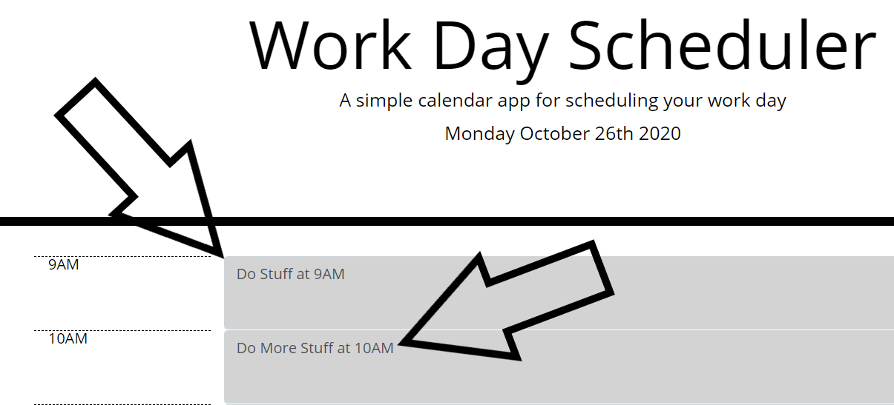
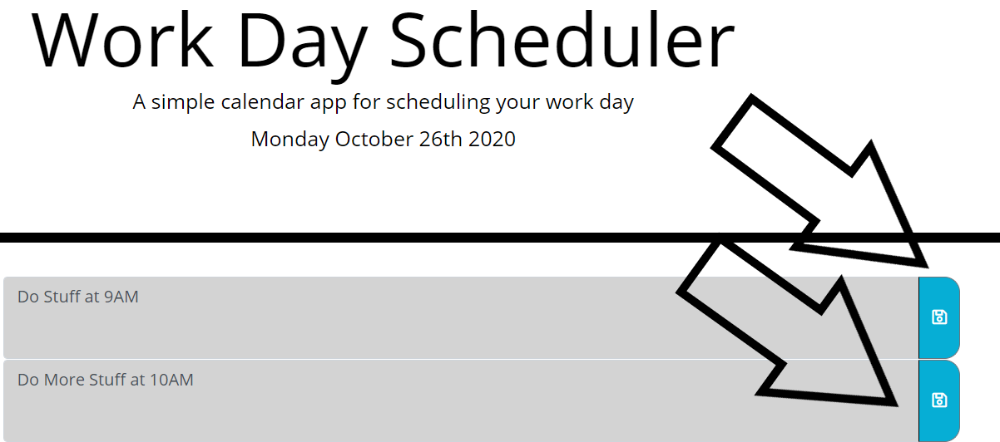

# Hourly Schedule

## Work Day Planner

### Overview:
In this repository I created a Work Day Planner.  The planner has hourly time blocks from 9AM - 5PM.  These time blocks allow you to click in them and add any plans you have for that hour!  After typing out your plans in a time block you can click the save button to store those plans.  The Time blocks are also color coded based on the time of day it is!  If an hour time block has already passed for the day it will display gray.  If a time block is the present hour of the day it will dislay red, and if the time block is in the future it will display green.  This was primarily accomplished using Jquery, Bootstrap, and moment.js.  

## How it works!

## Click in a Timeblock and add plans.

## Click the Save Button to Store Plans.

### Example
Here is a link to the Planner:  [https://vfavorito.github.io/daily-planner/](https://vfavorito.github.io/daily-planner/)

### Installation
To install this project simply clone this repository to your local directory and access it using Visual Studio Code

### License
Copyright <2020> < Vincent Favorito >

Permission is hereby granted, free of charge, to any person obtaining a copy of this software and associated documentation files (the "Software"), to deal in the Software without restriction, including without limitation the rights to use, copy, modify, merge, publish, distribute, sublicense, and/or sell copies of the Software, and to permit persons to whom the Software is furnished to do so, subject to the following conditions:

The above copyright notice and this permission notice shall be included in all copies or substantial portions of the Software.

THE SOFTWARE IS PROVIDED "AS IS", WITHOUT WARRANTY OF ANY KIND, EXPRESS OR IMPLIED, INCLUDING BUT NOT LIMITED TO THE WARRANTIES OF MERCHANTABILITY, FITNESS FOR A PARTICULAR PURPOSE AND NONINFRINGEMENT. IN NO EVENT SHALL THE AUTHORS OR COPYRIGHT HOLDERS BE LIABLE FOR ANY CLAIM, DAMAGES OR OTHER LIABILITY, WHETHER IN AN ACTION OF CONTRACT, TORT OR OTHERWISE, ARISING FROM, OUT OF OR IN CONNECTION WITH THE SOFTWARE OR THE USE OR OTHER DEALINGS IN THE SOFTWARE.